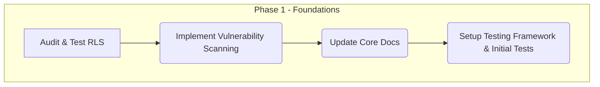
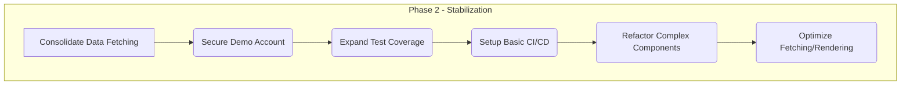
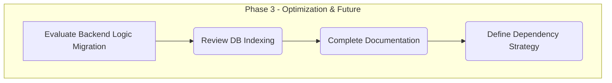

# Master Plan: PMIS EPMO Tool - Roadmap, Architecture, Analysis, and Plans

This document consolidates the roadmaps, architecture overview, analysis findings, and action plans for the PMIS EPMO Tool project.

---

## 1. Project Management Information System (PMIS) - EPMO Tool Analysis Report

**Date:** 2025-04-04

**Analyst:** Roo

### Executive Summary

This report provides a comprehensive analysis of the internal PMIS EPMO tool codebase. The application is a modern frontend built with React, TypeScript, Vite, Shadcn UI, and Tailwind CSS, using Supabase as its backend-as-a-service (BaaS).

The analysis identified several key strengths, including a modern tech stack and a well-structured component library. However, significant areas require attention to ensure long-term scalability, maintainability, security, and performance suitable for a critical EPMO tool.

**Key Findings & High-Priority Recommendations:**

1.  **Architecture:** The current frontend-heavy architecture, where most business logic resides client-side (within React components and Zustand stores), poses scalability and security risks. Data fetching is primarily handled within Zustand stores, bypassing the installed React Query library.
    *   **Recommendation (High Priority):** Conduct a thorough audit of Supabase Row Level Security (RLS) policies to ensure data is protected at the source, regardless of client-side logic.
    *   **Recommendation (Medium Priority):** Evaluate migrating complex business logic and data transformations from frontend components/stores to Supabase (potentially Views or Edge Functions if complexity warrants) or a dedicated backend service in the future.
    *   **Recommendation (Medium Priority):** Consolidate data fetching strategy – either fully utilize Zustand's async capabilities or refactor to leverage React Query for caching, background updates, and better server state management.
2.  **Security:** Client-side role checks (`AuthGuard`) are insufficient alone. The reliance on RLS is paramount but unverified within this analysis. Demo account auto-creation logic needs review for production environments.
    *   **Recommendation (Critical):** **Audit and rigorously test Supabase Row Level Security (RLS) policies** to ensure least privilege access based on user roles and project assignments.
    *   **Recommendation (High Priority):** Implement regular dependency vulnerability scanning (e.g., `npm audit`, Snyk).
    *   **Recommendation (Medium Priority):** Disable or properly secure the demo account auto-creation logic before production deployment.
3.  **Maintainability & Scalability:** Significant gaps exist in documentation (`README.md` is generic). The lack of automated tests (unit, integration) increases the risk of regressions. Inconsistent state/data fetching patterns add complexity.
    *   **Recommendation (High Priority):** Establish a comprehensive testing strategy and implement unit/integration tests for critical components and logic (stores, complex pages).
    *   **Recommendation (High Priority):** Significantly improve documentation: update `README.md` with project specifics, add architectural overview, document key components/stores, and establish contribution guidelines.
    *   **Recommendation (Medium Priority):** Set up a CI/CD pipeline for automated testing and deployments.
4.  **Code Quality:** The `no-unused-vars` ESLint rule is disabled, potentially hiding dead code. Some components (`ExecutiveReport`, `ProjectDetail`) exhibit high complexity with embedded data transformations.
    *   **Recommendation (Low Priority):** Re-enable the `@typescript-eslint/no-unused-vars` ESLint rule and clean up any reported issues.
    *   **Recommendation (Medium Priority):** Refactor complex components to separate concerns, potentially extracting data transformation logic into dedicated utility functions or hooks.
5.  **Performance:** Direct Supabase calls within Zustand stores lack the built-in caching and optimization features of libraries like React Query. Complex client-side data manipulation in components like `ExecutiveReport` could lead to UI freezes with larger datasets.
    *   **Recommendation (Medium Priority):** Analyze and optimize data fetching patterns within Zustand stores (e.g., ensure only necessary data is fetched, consider client-side caching if not migrating to React Query).
    *   **Recommendation (Medium Priority):** Profile and optimize rendering performance for complex pages, especially those handling large datasets or frequent updates (e.g., using `React.memo`, virtualization for long lists).

### Detailed Analysis

#### 1. Architectural Design

*   **Type:** Frontend-Heavy BaaS Architecture (React Frontend + Supabase BaaS).
*   **Evaluation:** The current architecture leverages Supabase effectively for data persistence, authentication, and potentially real-time features. However, placing significant business logic (data fetching, transformations, calculations observed in stores and pages like `ExecutiveReport`) directly within the frontend has drawbacks for an EPMO tool:
    *   **Scalability:** As complexity grows, managing intricate logic purely client-side becomes difficult, potentially leading to performance issues and tangled code.
    *   **Security:** Relying solely on client-side checks for authorization (`AuthGuard`) is insecure. Sensitive calculations or logic might be exposed. Data access control *must* be enforced server-side (via RLS).
    *   **Resilience:** Errors in client-side logic can break core functionality. Centralizing critical logic server-side can improve robustness.
*   **Technology Stack:** The chosen stack (React, TS, Vite, Shadcn, Tailwind, Zustand, Supabase) is modern and generally well-suited for building interactive web applications. The lack of React Query usage despite its installation is notable.
*   **Bottlenecks/Failures:**
    *   Potential client-side performance bottlenecks in complex data processing/rendering.
    *   Supabase itself represents a single point of failure for backend operations, typical for BaaS architectures. Ensure proper monitoring and backup strategies are in place via Supabase console.
*   **Inter-service Communication:** N/A (Monolithic frontend + BaaS).
*   **Recommendations:**
    *   **(High)** Audit and enforce Supabase RLS policies rigorously.
    *   **(Medium)** Evaluate moving complex/sensitive logic to Supabase Views or Edge Functions as the application evolves.
    *   **(Medium)** Consolidate data fetching (Zustand vs. React Query).
    *   **(Low)** Document the current architecture, including data flow and Supabase interaction patterns.

#### 2. Code Quality & Style

*   **Clarity & Consistency:** The project structure (`src/components`, `src/pages`, `src/lib`) follows common conventions. Component-based structure using Shadcn UI promotes consistency. ESLint is configured with recommended rules, providing a good baseline.
*   **Style Guide:** Implicitly follows standard TypeScript/React practices enforced by ESLint defaults. No specific named style guide (e.g., Airbnb) seems explicitly configured beyond the defaults.
*   **Complexity:** Components like `ExecutiveReport.tsx` and `ProjectDetail.tsx` show significant complexity due to multiple states, data transformations (reduces, maps, flatMaps), and conditional rendering logic embedded directly within the component. The `authStore.ts` also contains non-trivial logic for demo account creation.
*   **Duplication (DRY):** Requires deeper analysis, but the componentized nature likely reduces UI duplication. Logic duplication might exist, especially in data fetching/transformation if not properly abstracted.
*   **Error Handling:** Basic error handling exists (e.g., `try...catch` in `authStore`, toast notifications). Needs review for comprehensiveness, especially around Supabase API calls within other stores/components.
*   **Test Coverage:** **Major Gap.** No evidence of automated tests (`*.test.ts`, `*.spec.ts`) was found in the file structure. This is a critical risk for maintainability and introducing regressions.
*   **Recommendations:**
    *   **(High)** Implement a testing strategy (unit tests for stores/utils, integration tests for components/pages).
    *   **(Medium)** Refactor complex components (`ExecutiveReport`, `ProjectDetail`) to extract logic into hooks or utilities.
    *   **(Low)** Re-enable `@typescript-eslint/no-unused-vars` rule.
    *   **(Low)** Consider adopting stricter ESLint rule sets if desired.
    *   **(Low)** Review error handling consistency across data-fetching operations.

#### 3. Performance Optimization

*   **Bottlenecks:**
    *   **Data Fetching:** Fetching data directly within Zustand stores bypasses potential caching and optimization benefits of React Query. Repeated fetches or fetching overly large datasets are potential issues.
    *   **Client-Side Computation:** Complex data transformations and aggregations performed client-side (e.g., in `ExecutiveReport`) can block the main thread, especially with large EPMO datasets.
    *   **Rendering:** Complex pages with many components or large lists/tables could suffer from slow rendering without optimizations like memoization or virtualization.
*   **Database Queries:** Direct `supabase.from(...).select(...)` calls were found in `authStore`. Assuming a similar pattern in other stores, performance depends heavily on:
    *   **RLS Policy Performance:** Complex RLS policies can slow down queries.
    *   **Indexing:** Proper database indexes must be in place on Supabase tables (managed via Supabase dashboard/SQL).
    *   **Query Selectivity:** Fetching unnecessary columns (`select('*')` if used) or entire large tables can cause client-side and network bottlenecks.
*   **API Latency:** Dependent on Supabase API performance and network conditions.
*   **Frontend Rendering:** Default Vite/React setup. No specific optimizations (e.g., code splitting beyond route-based, virtualization) were apparent in the config or component structure analysis.
*   **Recommendations:**
    *   **(Medium)** Analyze data fetching in stores: ensure optimal `select` statements, consider caching strategies (manual in Zustand or migrate to React Query).
    *   **(Medium)** Profile rendering performance of complex pages (`ExecutiveReport`, `Dashboard`, `ProjectDetail`) using React DevTools and optimize (e.g., `React.memo`, `useMemo`, virtualization for lists).
    *   **(Medium)** Review Supabase table indexing based on common query patterns (requires access to Supabase dashboard/logs).
    *   **(Low)** Investigate potential benefits of route-based code splitting if initial load times become an issue.

#### 4. Security Vulnerabilities

*   **OWASP Top 10 Context:** Focus on Injection (via RLS bypass), Broken Access Control, Security Misconfiguration, Vulnerable Components.
*   **Authentication:** Handled via Supabase Auth (`signInWithPassword`, session management), which is generally secure. The demo account auto-creation logic in `authStore.ts` is a potential vulnerability if exposed in production.
*   **Authorization:** **Critical Weakness.** Relies heavily on client-side checks (`AuthGuard` checking `user.role`). This **does not protect the data API**. Any user could potentially craft requests to the Supabase API to access data they shouldn't if RLS is not properly configured.
*   **Data Security:** Supabase handles encryption at rest/in transit. PII handling (user emails, names) seems standard; ensure compliance requirements are met.
*   **Dependency Security:** No evidence of vulnerability scanning setup. `package.json` lists dependencies that could have known vulnerabilities.
*   **Secrets Management:** The Supabase `anon` key is correctly placed in client-side code. Server-side secrets (e.g., service role key) should *never* be in the frontend code.
*   **Recommendations:**
    *   **(Critical)** **Prioritize a thorough audit and testing of Supabase Row Level Security (RLS) policies.** Ensure policies correctly restrict access based on `auth.uid()` and custom user roles/project assignments.
    *   **(High)** Implement regular dependency vulnerability scanning (`npm audit` in CI, Snyk, etc.) and update vulnerable packages.
    *   **(Medium)** Review and disable/secure the demo account auto-creation logic for production.
    *   **(Low)** Ensure Supabase email confirmation is enabled for non-demo signups.

#### 5. Maintainability & Scalability

*   **Technical Debt:** Moderate. Key contributors are the lack of tests, inadequate documentation, inconsistent data fetching patterns, and potentially complex components needing refactoring.
*   **Comprehensibility:** The code structure is conventional. TypeScript usage helps. However, the lack of documentation and tests makes onboarding and understanding complex logic difficult.
*   **Modification/Extension:** The component-based architecture is good, but adding complex features will exacerbate issues related to client-side logic complexity, testing gaps, and potential state management inconsistencies if current patterns continue.
*   **Documentation:** **Major Gap.** The `README.md` is generic. No architectural diagrams, component/store documentation, or contribution guidelines were found.
*   **Dependency Management:** Uses `npm` and `package.json`/`package-lock.json`. Strategy for updates needs clarification.
*   **CI/CD Pipeline:** **Missing.** No evidence of automated build, test, or deployment pipelines found. This hinders development velocity and quality assurance.
*   **Observability:** Minimal. Relies on `console.log` and browser DevTools. No structured logging, monitoring, or tracing integration apparent.
*   **Recommendations:**
    *   **(High)** Create comprehensive documentation (update README, add architecture overview, document stores/APIs, setup guides).
    *   **(High)** Implement unit and integration tests.
    *   **(Medium)** Establish a CI/CD pipeline (e.g., GitHub Actions, GitLab CI) including linting, testing, and deployment steps.
    *   **(Medium)** Consolidate data fetching/state management approach (Zustand vs. React Query).
    *   **(Low)** Adopt a dependency update strategy.
    *   **(Low)** Consider integrating basic logging/monitoring if needed.

---

## 2. Proposed Execution Roadmap (Revised v3)

### Phase 0: Comprehensive Discovery and Analysis

*   **Goal:** Gain a comprehensive understanding of the current state, functionality, component structure, and user experience of **all** application pages and core features.
*   **Key Actions:**
    *   Identify and list all distinct pages/routes within the application.
    *   Review each page to inventory its current features and functionalities.
    *   **Identify and document the usage of key UI components across different pages.**
    *   Map key user flows across the entire application.
    *   Identify potential pain points, usability issues, inconsistencies, or bugs across all reviewed areas.
    *   Document findings in a consolidated report, providing a complete overview of the application's current state and component architecture.

```mermaid
graph TD
    subgraph Phase 0 - Comprehensive Discovery & Analysis
        P0A[Identify All Pages/Routes] --> P0B(Inventory Features per Page);
        P0B --> P0F(Identify Component Usage);  // New Action
        P0F --> P0C(Map Key User Flows - Application Wide);
        P0C --> P0D(Identify Issues - Application Wide);
        P0D --> P0E(Document Findings - Consolidated Report);
    end
```

### Phase 1: Foundational Security & Stability

*   **Goal:** Address critical security vulnerabilities and establish foundational practices for maintainability.
*   **Key Actions:**
    *   **Security:** Audit and rigorously test Supabase Row Level Security (RLS) policies.
    *   **Security:** Implement automated dependency vulnerability scanning.
    *   **Maintainability:** Update core documentation (`README.md`, `ARCHITECTURE.md`).
    *   **Maintainability:** Set up a testing framework (Vitest) and write initial unit tests for critical logic (e.g., `authStore`).



### Phase 2: Stabilization & Refinement

*   **Goal:** Stabilize the architecture, improve code quality, enhance performance, and automate processes.
*   **Key Actions:**
    *   **Architecture:** Decide on and consolidate the data fetching strategy (Zustand vs. React Query) and begin refactoring.
    *   **Security:** Review and secure demo account logic.
    *   **Maintainability:** Expand test coverage (integration tests).
    *   **Maintainability:** Set up a basic CI/CD pipeline (linting, testing).
    *   **Code Quality:** Refactor complex components.
    *   **Performance:** Optimize data fetching and rendering.



### Phase 3: Long-Term Strategy & Optimization

*   **Goal:** Address remaining lower-priority items, further optimize, and plan for future scalability.
*   **Key Actions:**
    *   **Architecture:** Evaluate moving logic to Supabase backend (Edge Functions/Views).
    *   **Performance:** Review Supabase database indexing.
    *   **Maintainability:** Complete documentation and establish contribution guidelines.
    *   **Maintainability:** Define a dependency update strategy.



---

## 3. PMIS EPMO Tool - Proposed Change Plan

This plan outlines the steps to address the findings from the `PMIS_ANALYSIS_REPORT.md`, prioritizing actions based on criticality and impact on security, maintainability, scalability, and performance.

### Phase 1: Immediate Actions (Critical & High Priority - Foundational Security & Stability)

**Goal:** Address critical security vulnerabilities and establish foundational practices for maintainability.

*   **Security (Critical):**
    *   **Action:** Conduct a thorough audit and implement rigorous testing for Supabase Row Level Security (RLS) policies.
    *   **Rationale:** Ensures data access control is enforced server-side, mitigating the most critical identified vulnerability.
    *   **Reference:** Report Sec 2, Sec 4, Arch 1.
*   **Security (High):**
    *   **Action:** Implement regular dependency vulnerability scanning (e.g., `npm audit` integrated into CI/local checks, Snyk).
    *   **Rationale:** Proactively identifies and allows mitigation of known vulnerabilities in third-party packages.
    *   **Reference:** Report Sec 2, Sec 4.
*   **Maintainability (High):**
    *   **Action:** Begin documentation overhaul:
        *   Update `README.md` with accurate project setup, purpose, and core technology stack details.
        *   Create a basic `ARCHITECTURE.md` outlining the current frontend-BaaS structure, data flow (Zustand/Supabase), and key components.
    *   **Rationale:** Improves project understanding for current and future developers, reducing onboarding time and errors.
    *   **Reference:** Report Sec 3, Sec 5.
*   **Maintainability (High):**
    *   **Action:** Establish an initial testing strategy and setup:
        *   Configure a testing framework (e.g., Vitest).
        *   Implement initial unit tests for critical logic (e.g., `authStore`, core utility functions).
    *   **Rationale:** Creates a foundation for automated testing, reducing regression risks early on.
    *   **Reference:** Report Sec 3, Sec 5, Sec 2.

### Phase 2: Near-Term Improvements (High & Medium Priority - Stabilization & Refinement)

**Goal:** Stabilize the architecture, improve code quality, enhance performance, and automate processes.

*   **Architecture/Maintainability (Medium):**
    *   **Action:** Decide on and consolidate the data fetching strategy (Zustand async vs. React Query). Begin refactoring key areas to align with the chosen strategy.
    *   **Rationale:** Reduces complexity, improves consistency, and leverages chosen library features (e.g., caching if React Query).
    *   **Reference:** Report Arch 1, Perf 3, Maint 5.
*   **Security (Medium):**
    *   **Action:** Review and disable or properly secure the demo account auto-creation logic for production environments.
    *   **Rationale:** Removes a potential security loophole identified in the `authStore`.
    *   **Reference:** Report Sec 2, Sec 4.
*   **Maintainability (High/Medium):**
    *   **Action:** Expand test coverage:
        *   Add unit tests for other stores (`projectStore`, `portfolioStore`).
        *   Implement integration tests for key components/pages (e.g., Login, Dashboard).
    *   **Rationale:** Increases confidence in code changes and further reduces regression risks.
    *   **Reference:** Report Sec 3, Sec 5.
*   **Maintainability (Medium):**
    *   **Action:** Set up a basic CI/CD pipeline (e.g., GitHub Actions):
        *   Include steps for linting (`eslint`).
        *   Include steps for running automated tests.
        *   (Optional) Add basic build step.
    *   **Rationale:** Automates quality checks and prepares for automated deployments.
    *   **Reference:** Report Sec 3, Sec 5.
*   **Code Quality (Medium):**
    *   **Action:** Refactor complex components identified (e.g., `ExecutiveReport`, `ProjectDetail`) to separate concerns, extracting data transformation logic into hooks or utilities.
    *   **Rationale:** Improves readability, maintainability, and testability of complex UI sections.
    *   **Reference:** Report Sec 4, Sec 2.
*   **Performance (Medium):**
    *   **Action:** Analyze and optimize data fetching patterns based on the chosen strategy (Phase 2, Arch/Maint action). Ensure only necessary data is fetched.
    *   **Rationale:** Reduces unnecessary load on Supabase and client-side processing.
    *   **Reference:** Report Perf 3, Arch 1.
*   **Performance (Medium):**
    *   **Action:** Profile rendering performance of complex pages using React DevTools and apply optimizations (e.g., `React.memo`, `useMemo`) where needed.
    *   **Rationale:** Improves UI responsiveness, especially with larger datasets.
    *   **Reference:** Report Perf 3.

### Phase 3: Long-Term Strategy & Optimization (Medium & Low Priority - Enhancements)

**Goal:** Address remaining lower-priority items, further optimize, and plan for future scalability.

*   **Architecture (Medium):**
    *   **Action:** Evaluate migrating complex/sensitive business logic currently in the frontend to Supabase (Views, Edge Functions) or a dedicated backend service if future needs dictate.
    *   **Rationale:** Improves security, scalability, and centralizes critical logic.
    *   **Reference:** Report Arch 1.
*   **Performance (Medium):**
    *   **Action:** Review Supabase table indexing based on common query patterns (requires Supabase dashboard access).
    *   **Rationale:** Optimizes database query performance.
    *   **Reference:** Report Perf 3.
*   **Code Quality (Low):**
    *   **Action:** Re-enable the `@typescript-eslint/no-unused-vars` ESLint rule and clean up reported issues.
    *   **Rationale:** Removes dead code and improves code hygiene.
    *   **Reference:** Report Sec 4, Sec 2.
*   **Maintainability (High/Low):**
    *   **Action:** Complete documentation:
        *   Document key components and stores.
        *   Establish clear contribution guidelines (`CONTRIBUTING.md`).
    *   **Rationale:** Ensures the project remains maintainable and understandable as it evolves.
    *   **Reference:** Report Sec 3, Sec 5.
*   **Maintainability (Low):**
    *   **Action:** Define and adopt a dependency update strategy.
    *   **Rationale:** Keeps the project up-to-date with security patches and library improvements.
    *   **Reference:** Report Sec 5.
*   **Maintainability (Low):**
    *   **Action:** Consider integrating basic logging/monitoring tools if application complexity or user base grows significantly.
    *   **Rationale:** Improves observability for debugging production issues.
    *   **Reference:** Report Sec 5.
*   **Other Low Priority Items:**
    *   Review error handling consistency across data fetching. (Sec 2)
    *   Investigate route-based code splitting if needed. (Perf 3)
    *   Consider adopting stricter ESLint rules. (Sec 2)
    *   Ensure Supabase email confirmation is enabled. (Sec 4)

**Next Steps:**

1.  Review and approve this change plan.
2.  Begin implementation starting with Phase 1 priorities.
3.  Track progress against these phases.

---

## 4. Architecture Overview - PMIS EPMO Tool

### 1. High-Level Design

This application follows a **Frontend-Heavy BaaS (Backend-as-a-Service)** architecture.

*   **Frontend:** A single-page application (SPA) built with React, TypeScript, and Vite. It handles user interface rendering, client-side routing, state management, and interacts directly with the BaaS provider.
*   **Backend (BaaS):** Supabase is used as the backend provider, handling:
    *   **Authentication:** User login, session management.
    *   **Database:** PostgreSQL database for storing project, portfolio, user, and other application data.
    *   **APIs:** Provides auto-generated RESTful and real-time APIs for database interaction.
    *   **(Potential):** Supabase Edge Functions could be used for server-side logic if needed in the future.

```mermaid
graph LR
    A[User Browser] -- HTTPS --> B(React Frontend on Hosting/CDN);
    B -- Supabase API Calls (HTTPS) --> C(Supabase);
    C -- Contains --> D[Authentication];
    C -- Contains --> E[PostgreSQL Database];
    C -- Contains --> F[Storage (Optional)];
    C -- Contains --> G[Edge Functions (Optional)];

