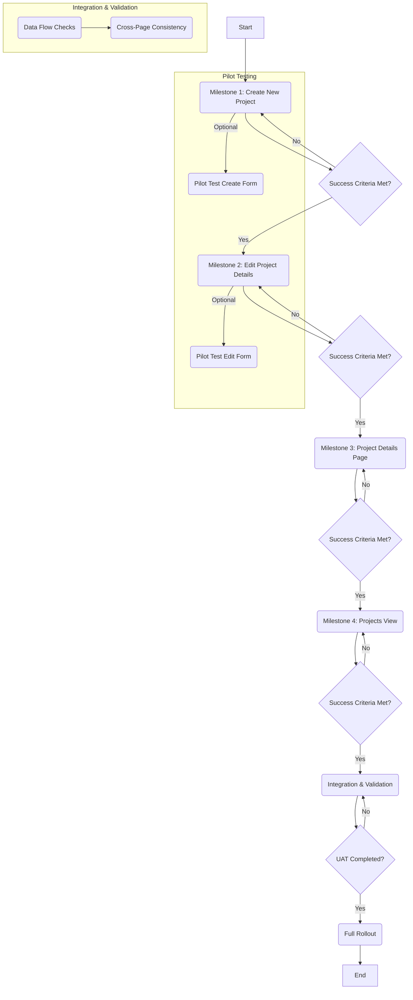

## PMIS Page Alignment Execution Plan

This plan outlines the steps to enhance the PMIS views to align with the Project Charter and Consolidated Reporting formats, as detailed in `PMIS_Page_Alignment_Guide.md`.

### Phase 1: Document Analysis

*   **Core Objectives:**
    *   Align PMIS data capture and display with official Project Charter structure.
    *   Ensure consistency with Executive Consolidation Reporting requirements.
    *   Improve User Experience (UX) through better field grouping and visual enhancements.
    *   Enhance data visibility for key metrics (Budget, KPIs, Status, Risks).
*   **Technical Specifications (Summary):**
    *   **Create New Project:** Add specific fields (Initiative Code, Project Code, Strategic Objective, KPIs, Deliverables, Sponsor, Owner). Group fields logically.
    *   **Project Details Page:** Add visual timeline (Gantt), detailed Stage Gates, Budget Insights section, Strategic Alignment box, enhanced Team section. Implement tabbed navigation for lower sections.
    *   **Edit Project Details Page:** Add missing fields (Initiative Code, Forecasted Spend, Strategic KPI, Editable Deliverables). Mirror the section-based layout of the "Create Project" page.
    *   **Projects View (Card Grid):** Add Project Phase, Status Badges, Risk Badge, Budget Variance, Hover Tooltip with details. Implement new filtering options (Portfolio, Status, Objective, PM).
*   **Constraints:**
    *   Changes must be implemented across four distinct views/pages.
    *   Potential need for backend/database schema changes to support new fields.
    *   Requires frontend development effort for UI changes, new components (Gantt, charts), and layout adjustments.
    *   Dependency on existing data structures and potential data migration needs.
*   **Interdependencies:**
    *   Fields added in "Create New Project" must be available and editable in "Edit Project Details".
    *   Data captured in "Create/Edit" pages must be correctly displayed in "Project Details" and "Projects View".
    *   Dropdowns (Strategic Objective, KPIs) require defined data sources.
    *   Filtering options in "Projects View" depend on the data being available and correctly tagged for each project.

### Phase 2: Phased Deployment

This phase breaks down the implementation into manageable milestones, focusing on one PMIS view at a time.

*   **Milestone 1: Implement "Create New Project" Enhancements**
    *   **Tasks:** Add new fields, implement grouping, ensure data saving.
    *   **Success Criteria:** All specified fields are present, correctly grouped, accept input, and data persists upon saving. UI matches design intent.
    *   **Pilot:** Optionally release to a small group of PMs for initial feedback on usability.
*   **Milestone 2: Implement "Edit Project Details" Enhancements**
    *   **Tasks:** Add new fields, ensure existing data loads correctly, implement section-based layout matching "Create Project", ensure edits persist.
    *   **Success Criteria:** All specified fields are present and editable. Page layout mirrors "Create Project". Data loads correctly, edits are saved. Consistency with "Create Project" is maintained.
*   **Milestone 3: Implement "Project Details Page" Enhancements**
    *   **Tasks:** Implement Gantt chart, Stage Gate details, Budget Insights, Strategic Alignment box, enhanced Team section, tabbed navigation.
    *   **Success Criteria:** All new sections and components are present and display data correctly. Gantt chart visualizes timeline data. Tabs function correctly. Data displayed matches saved project information.
*   **Milestone 4: Implement "Projects View (Card Grid)" Enhancements**
    *   **Tasks:** Update card layout (Phase, Badges, Budget), implement hover tooltip, add filtering options.
    *   **Success Criteria:** Cards display all new required information accurately. Badges reflect project status/risk. Tooltip shows correct details. Filtering options function correctly and update the grid view.
*   **Integration & Validation:**
    *   **Tasks:** Verify data flow between Create/Edit and Details/View pages. Test consistency across all views. Perform end-to-end testing for a project lifecycle.
    *   **Success Criteria:** Data entered/edited in one view is accurately reflected in others. No data loss or inconsistency. End-to-end scenarios function as expected.
*   **User Acceptance Testing (UAT):**
    *   **Tasks:** Selected end-users test the enhanced views against predefined scenarios.
    *   **Success Criteria:** UAT sign-off obtained, critical issues resolved.
*   **Full Rollout:**
    *   **Tasks:** Deploy changes to the production environment. Announce changes to all users. Provide necessary documentation or training updates.
    *   **Success Criteria:** Successful deployment. System stability confirmed post-launch.

### Phase 3: Post-Execution Review

*   **Feedback Collection:**
    *   Implement a feedback mechanism (e.g., in-app survey, dedicated feedback channel) for 1-2 months post-rollout.
    *   Conduct brief interviews with key user groups (PMs, Executives) to gather qualitative insights.
*   **Performance Monitoring:**
    *   Monitor page load times and system performance for the updated views.
    *   Track usage patterns for new features (e.g., filter usage, tab clicks).
*   **Iterative Optimization:**
    *   Schedule a review meeting 1 month post-rollout to analyze feedback and performance data.
    *   Prioritize bug fixes and minor usability enhancements based on findings.
    *   Plan for potential future iterations based on strategic needs or further user feedback.

### Prioritized Task List (High-Level)

1.  **Backend:** Define/update database schema for new fields (Initiative Code, Project Code, Strategic Objective, KPIs, Deliverables, Sponsor, Owner, Forecasted Spend, Phase, Status, Risk Level).
2.  **Backend:** Create/update API endpoints for CRUD operations on new/modified project data.
3.  **Backend:** Implement logic for data sources (e.g., fetching Strategic Objectives, KPIs).
4.  **Frontend (Create Project):** Implement new input fields (text, dropdown, multi-tag, multi-line).
5.  **Frontend (Create Project):** Implement UX grouping/layout.
6.  **Frontend (Edit Project):** Implement new input fields and ensure data loading.
7.  **Frontend (Edit Project):** Replicate section-based layout from Create Project.
8.  **Frontend (Project Details):** Integrate/develop Gantt chart component.
9.  **Frontend (Project Details):** Implement Stage Gate display logic (icons, checks).
10. **Frontend (Project Details):** Implement Budget Insights section (visuals, variance calc).
11. **Frontend (Project Details):** Implement Strategic Alignment box (tag display).
12. **Frontend (Project Details):** Implement enhanced Team section (avatars, hover).
13. **Frontend (Project Details):** Implement tabbed navigation for lower sections.
14. **Frontend (Projects View):** Update Project Card component layout (Phase, Badges, Budget).
15. **Frontend (Projects View):** Implement hover tooltip on cards.
16. **Frontend (Projects View):** Implement filtering components and logic.
17. **Testing:** Unit tests for new components and logic.
18. **Testing:** Integration tests for data flow across pages.
19. **Testing:** End-to-end tests for user scenarios.
20. **UAT:** Prepare UAT scenarios and coordinate testing.
21. **Deployment:** Plan and execute deployment to staging and production.
22. **Post-Launch:** Monitor system, collect feedback, plan optimizations.

---