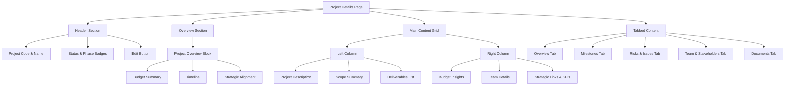
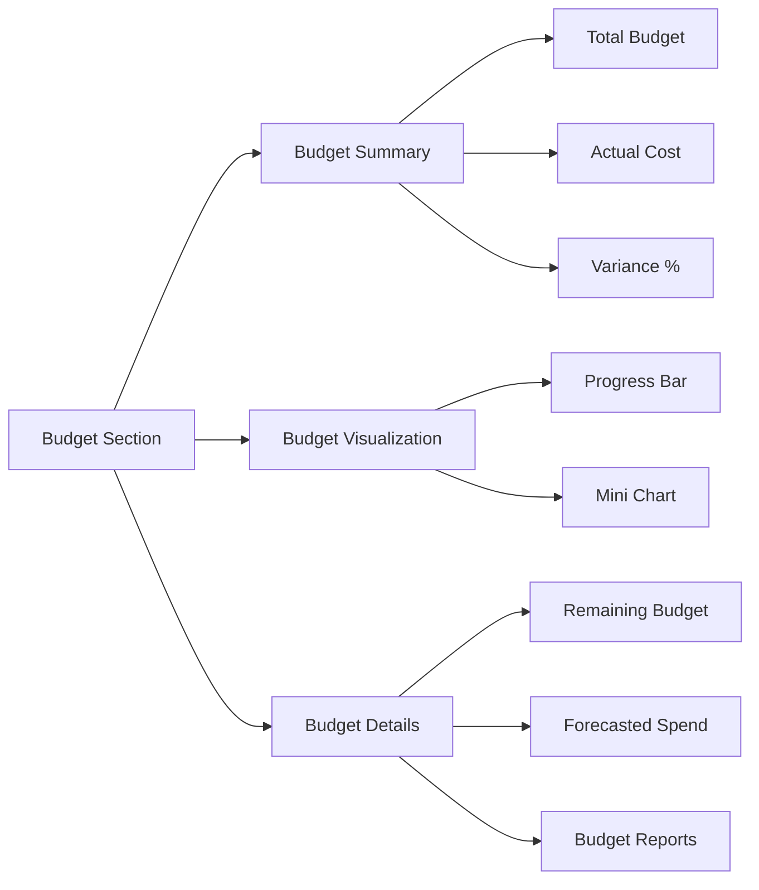
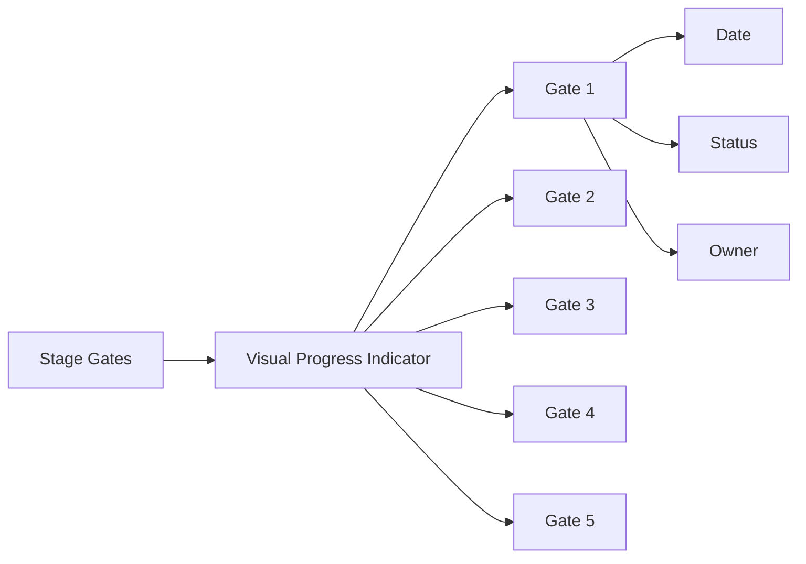

# Project Details Page Implementation Plan

Based on the enhancement plan and current codebase, here's a detailed implementation plan for the Project Details page.

## 1. Structure & Layout Reorganization



### Implementation Steps:

1. Restructure the header section to prominently display project code, name, status, and phase
2. Create a new Project Overview block that combines budget, timeline, and strategic alignment
3. Reorganize the main content into a two-column layout
4. Ensure responsive design for different screen sizes

## 2. Content Additions

### Project Overview Block
- Add project code display with proper formatting (e.g., PRJ-2025-003)
- Add initiative code display with proper formatting (e.g., 3.2)
- Display phase with appropriate styling
- Include key project attributes in a concise format

### Project Description
- Expand the description section to include full scope and objectives
- Add sections for purpose, beneficiaries, and high-level outcomes
- Improve text formatting for better readability

### Deliverables
- Create a new deliverables section with checklist-style display
- Add visual indicators for deliverable status
- Implement badge-style display for deliverable types

## 3. Budget Section Enhancements



### Implementation Steps:

1. Add budget variance calculation and display
2. Create mini bar/pie chart for budget vs. actual visualization
3. Add tooltips explaining budget utilization
4. Link "Reports" icon to actual budget attachments
5. Add forecasted spend display if available

## 4. Team & Roles Enhancement

- Improve display of project manager, sponsor, owner, and supporting staff
- Add avatars with tooltips for clarity
- Organize team members by role
- Improve visual hierarchy of team information

## 5. Project Timeline (Gantt) Improvements

- Replace flat bar with Gantt-style segment visualization
- Add milestone labels with title and date
- Color-code milestones by status
- Consider adding zoom control for month/quarter view

## 6. Stage Gates Visualization



### Implementation Steps:

1. Convert stage gates list to visual progress indicator
2. Add gate dates, completion status, and owner information
3. Implement click-to-expand functionality for gate details
4. Add visual indicators for gate status

## 7. Project Documents Enhancement

- Add support for PDF/DOCX preview
- Implement document tagging system (Charter, Risk Log, Budget)
- Display uploaded date and owner information
- Improve upload functionality with drag-and-drop support

## 8. Tabbed View Implementation

- Reorganize content into logical tabs:
  - Overview (default)
  - Milestones
  - Risks & Issues
  - Team & Stakeholders
  - Documents
- Ensure smooth navigation between tabs
- Maintain state when switching between tabs

## Technical Implementation Approach

1. **Component Structure**:
   - Create reusable components for each section
   - Use composition pattern for flexible layout
   - Implement responsive design using grid and flex layouts

2. **Data Handling**:
   - Leverage existing project store for data management
   - Implement proper loading states for async operations
   - Add error handling for failed operations

3. **UI Components**:
   - Use existing UI component library (shadcn/ui)
   - Create new specialized components as needed
   - Ensure consistent styling across all components

4. **Performance Considerations**:
   - Lazy load content in tabs
   - Optimize rendering of large data sets
   - Use memoization for expensive calculations

## Implementation Sequence

1. First, restructure the header and main layout
2. Implement the overview section with key project attributes
3. Enhance the budget section with visualizations
4. Improve team and roles display
5. Upgrade the timeline and stage gates visualizations
6. Enhance the documents section
7. Implement the tabbed view structure
8. Add final polish and refinements

## Code Implementation Details

### 1. Header Section Restructuring

```jsx
<div className="flex flex-col sm:flex-row sm:items-center justify-between gap-4">
  <div className="flex items-center gap-2">
    <Button asChild variant="ghost" size="icon" className="h-8 w-8">
      <Link to="/projects">
        <ArrowLeft className="h-4 w-4" />
      </Link>
    </Button>
    <div className="flex flex-col">
      <h1 className="text-2xl font-bold">
        {selectedProject.projectCode && 
          <span className="text-primary/80 mr-2">{selectedProject.projectCode}</span>
        }
        {selectedProject.name}
      </h1>
      <div className="flex items-center gap-2 mt-1">
        {getStatusBadge(selectedProject.status)}
        {getPhaseBadge(selectedProject.phase)}
        {selectedProject.initiativeCode && 
          <Badge variant="outline" className="bg-blue-50 text-blue-700">
            Initiative: {selectedProject.initiativeCode}
          </Badge>
        }
      </div>
    </div>
  </div>
  <div className="flex gap-2">
    <Button variant="outline" size="sm" asChild>
      <Link to={`/projects/${id}/edit`}>
        <Edit className="h-4 w-4 mr-2" />
        <span>Edit</span>
      </Link>
    </Button>
  </div>
</div>
```

### 2. Project Overview Block

```jsx
<Card className="mb-6">
  <CardHeader className="pb-2">
    <CardTitle className="text-lg font-medium">Project Overview</CardTitle>
  </CardHeader>
  <CardContent>
    <div className="grid grid-cols-1 md:grid-cols-3 gap-6">
      {/* Timeline Section */}
      <div className="space-y-2">
        <h3 className="text-sm font-medium text-muted-foreground">Timeline</h3>
        <div className="flex items-center gap-2">
          <CalendarRange className="h-4 w-4 text-muted-foreground" />
          <span className="font-medium">
            {format(new Date(selectedProject.startDate), 'MMM d, yyyy')} - 
            {format(new Date(selectedProject.endDate), 'MMM d, yyyy')}
          </span>
        </div>
        <div className="mt-2">
          <Progress 
            value={calculateTimeProgress(selectedProject.startDate, selectedProject.endDate)} 
            className="h-2" 
          />
          <div className="flex justify-between text-xs mt-1">
            <span>Start</span>
            <span>End</span>
          </div>
        </div>
      </div>

      {/* Budget Summary */}
      <div className="space-y-2">
        <h3 className="text-sm font-medium text-muted-foreground">Budget</h3>
        <div className="flex justify-between">
          <span className="text-sm">Budget:</span>
          <span className="font-medium">${selectedProject.budget.toLocaleString()}</span>
        </div>
        <div className="flex justify-between">
          <span className="text-sm">Spent:</span>
          <span className={cn(
            "font-medium",
            selectedProject.actualCost > selectedProject.budget && "text-risk-high"
          )}>
            ${selectedProject.actualCost.toLocaleString()}
          </span>
        </div>
        <div className="flex justify-between">
          <span className="text-sm">Variance:</span>
          <span className={cn(
            "font-medium",
            getBudgetVariancePercentage(selectedProject) > 10 && "text-risk-high",
            getBudgetVariancePercentage(selectedProject) < 0 && "text-green-600"
          )}>
            {getBudgetVariancePercentage(selectedProject)}%
          </span>
        </div>
      </div>

      {/* Strategic Alignment */}
      <div className="space-y-2">
        <h3 className="text-sm font-medium text-muted-foreground">Alignment</h3>
        {selectedProject.owningDepartment && (
          <div className="flex justify-between">
            <span className="text-sm">Department:</span>
            <span className="font-medium">{selectedProject.owningDepartment}</span>
          </div>
        )}
        {selectedProject.portfolioId && portfolio && (
          <div className="flex justify-between">
            <span className="text-sm">Portfolio:</span>
            <Link to={`/portfolios/${selectedProject.portfolioId}`} className="font-medium text-primary hover:underline">
              {portfolio.name}
            </Link>
          </div>
        )}
        {selectedProject.corporateObjectives?.length > 0 && (
          <div className="flex flex-wrap gap-1 mt-1">
            {selectedProject.corporateObjectives.slice(0, 2).map((obj, index) => (
              <Badge key={index} variant="outline">{obj}</Badge>
            ))}
            {selectedProject.corporateObjectives.length > 2 && (
              <Badge variant="outline">+{selectedProject.corporateObjectives.length - 2}</Badge>
            )}
          </div>
        )}
      </div>
    </div>
  </CardContent>
</Card>
```

### 3. Main Content Grid

```jsx
<div className="grid grid-cols-1 lg:grid-cols-3 gap-6">
  {/* Left Column (2/3 width) */}
  <div className="lg:col-span-2 space-y-6">
    {/* Project Description */}
    <Card>
      <CardHeader className="pb-2">
        <CardTitle className="text-sm font-medium">Project Description</CardTitle>
      </CardHeader>
      <CardContent>
        <p className="text-sm text-muted-foreground whitespace-pre-line">
          {selectedProject.description}
        </p>
      </CardContent>
    </Card>

    {/* Deliverables */}
    {selectedProject.deliverables?.length > 0 && (
      <Card>
        <CardHeader className="pb-2">
          <CardTitle className="text-sm font-medium">Key Deliverables</CardTitle>
        </CardHeader>
        <CardContent>
          <ul className="space-y-2">
            {selectedProject.deliverables.map((deliverable, index) => (
              <li key={index} className="flex items-center gap-2">
                <div className="h-5 w-5 rounded-full border flex items-center justify-center">
                  <Check className="h-3 w-3 text-primary" />
                </div>
                <span className="text-sm">{deliverable}</span>
              </li>
            ))}
          </ul>
        </CardContent>
      </Card>
    )}

    {/* Stage Gates Visualization */}
    <Card>
      <CardHeader className="pb-2">
        <CardTitle className="text-sm font-medium">Stage Gates</CardTitle>
      </CardHeader>
      <CardContent>
        <div className="relative">
          <div className="flex justify-between mb-2">
            {selectedProject.stageGates.map((gate, index) => (
              <div key={index} className="flex flex-col items-center">
                <div className={cn(
                  "h-8 w-8 rounded-full flex items-center justify-center",
                  gate.status === 'completed' ? "bg-green-500 text-white" : 
                  gate.status === 'in_progress' ? "bg-blue-500 text-white" : 
                  gate.status === 'blocked' ? "bg-risk-high text-white" : 
                  "bg-muted text-muted-foreground"
                )}>
                  {gate.stage}
                </div>
                <span className="text-xs mt-1">{getGateLabel(gate.stage)}</span>
              </div>
            ))}
          </div>
          <div className="absolute top-4 left-0 right-0 h-0.5 bg-muted -z-10"></div>
        </div>
      </CardContent>
    </Card>

    {/* Gantt Chart */}
    <Card>
      <CardHeader className="pb-2">
        <CardTitle className="text-sm font-medium">Project Timeline</CardTitle>
      </CardHeader>
      <CardContent>
        <GanttChart
          startDate={selectedProject.startDate}
          endDate={selectedProject.endDate}
          milestones={selectedProject.milestones}
        />
      </CardContent>
    </Card>
  </div>

  {/* Right Column (1/3 width) */}
  <div className="space-y-6">
    {/* Budget Insights */}
    <Card>
      <CardHeader className="pb-2">
        <CardTitle className="text-sm font-medium">Budget Insights</CardTitle>
      </CardHeader>
      <CardContent>
        <div className="space-y-4">
          <div className="space-y-2">
            <div className="flex justify-between text-xs">
              <span>Budget Utilization</span>
              <span className={cn(
                "font-medium",
                (selectedProject.actualCost / selectedProject.budget) > 0.9 && "text-risk-high"
              )}>
                {Math.round((selectedProject.actualCost / selectedProject.budget) * 100)}%
              </span>
            </div>
            <Progress
              value={(selectedProject.actualCost / selectedProject.budget) * 100}
              className={cn(
                "h-2",
                (selectedProject.actualCost / selectedProject.budget) > 0.9 && "text-risk-high"
              )}
            />
          </div>

          <div className="grid grid-cols-3 gap-2">
            <div className="flex flex-col items-center bg-primary/5 rounded p-2">
              <DollarSign className="h-4 w-4 text-primary mb-1" />
              <span className="text-xs text-muted-foreground">Remaining</span>
              <span className="text-sm font-medium">${(selectedProject.budget - selectedProject.actualCost).toLocaleString()}</span>
            </div>

            <div className="flex flex-col items-center bg-primary/5 rounded p-2">
              <Upload className="h-4 w-4 text-primary mb-1" />
              <span className="text-xs text-muted-foreground">Forecast</span>
              <span className="text-sm font-medium">--</span>
            </div>

            <div className="flex flex-col items-center bg-primary/5 rounded p-2">
              <FileText className="h-4 w-4 text-primary mb-1" />
              <span className="text-xs text-muted-foreground">Reports</span>
              <span className="text-sm font-medium">2</span>
            </div>
          </div>
        </div>
      </CardContent>
    </Card>

    {/* Team Details */}
    <Card>
      <CardHeader className="pb-2">
        <CardTitle className="text-sm font-medium">Team & Resources</CardTitle>
      </CardHeader>
      <CardContent>
        <div className="space-y-3">
          {selectedProject.projectOwner && (
            <div className="flex items-center justify-between">
              <div className="flex items-center gap-2">
                <Avatar className="h-8 w-8">
                  <AvatarImage src={`https://ui-avatars.com/api/?name=${selectedProject.projectOwner.replace(' ', '+')}&background=2563EB&color=fff`} />
                  <AvatarFallback>{selectedProject.projectOwner.substring(0, 2)}</AvatarFallback>
                </Avatar>
                <div>
                  <p className="text-sm font-medium">{selectedProject.projectOwner}</p>
                  <p className="text-xs text-muted-foreground">owner@example.com</p>
                </div>
              </div>
              <Badge variant="outline" className="bg-blue-50 text-blue-700 border-blue-200">Owner</Badge>
            </div>
          )}

          {selectedProject.projectSponsor && (
            <div className="flex items-center justify-between">
              <div className="flex items-center gap-2">
                <Avatar className="h-8 w-8">
                  <AvatarImage src={`https://ui-avatars.com/api/?name=${selectedProject.projectSponsor.replace(' ', '+')}&background=6366F1&color=fff`} />
                  <AvatarFallback>{selectedProject.projectSponsor.substring(0, 2)}</AvatarFallback>
                </Avatar>
                <div>
                  <p className="text-sm font-medium">{selectedProject.projectSponsor}</p>
                  <p className="text-xs text-muted-foreground">sponsor@example.com</p>
                </div>
              </div>
              <Badge variant="outline" className="bg-indigo-50 text-indigo-700 border-indigo-200">Sponsor</Badge>
            </div>
          )}

          <div className="flex items-center justify-between">
            <div className="flex items-center gap-2">
              <Avatar className="h-8 w-8">
                <AvatarImage src="https://ui-avatars.com/api/?name=Project+Manager&background=059669&color=fff" />
                <AvatarFallback>PM</AvatarFallback>
              </Avatar>
              <div>
                <p className="text-sm font-medium">Project Manager</p>
                <p className="text-xs text-muted-foreground">pm@example.com</p>
              </div>
            </div>
            <Badge variant="outline" className="bg-green-50 text-green-700 border-green-200">PM</Badge>
          </div>

          {selectedProject.resources.length > 0 && (
            <>
              <Separator className="my-2" />
              <div className="flex flex-wrap gap-2">
                {selectedProject.resources.map((resource, index) => (
                  <Tooltip key={index}>
                    <TooltipTrigger>
                      <Avatar className="h-8 w-8">
                        <AvatarImage src={`https://ui-avatars.com/api/?name=${resource.name.replace(' ', '+')}&background=F59E0B&color=fff`} />
                        <AvatarFallback>{resource.name.substring(0, 2)}</AvatarFallback>
                      </Avatar>
                    </TooltipTrigger>
                    <TooltipContent>
                      <p className="font-medium">{resource.name}</p>
                      <p className="text-xs">{resource.role}</p>
                    </TooltipContent>
                  </Tooltip>
                ))}
                <Button variant="outline" size="icon" className="h-8 w-8 rounded-full" onClick={() => setIsAddTeamMemberModalOpen(true)}>
                  <Plus className="h-4 w-4" />
                </Button>
              </div>
            </>
          )}
        </div>
      </CardContent>
    </Card>

    {/* Strategic Links & KPIs */}
    <Card>
      <CardHeader className="pb-2">
        <CardTitle className="text-sm font-medium">Strategic Alignment</CardTitle>
      </CardHeader>
      <CardContent>
        {selectedProject.corporateObjectives?.length > 0 && (
          <div className="mb-4">
            <div className="text-sm text-muted-foreground mb-2">Corporate Objectives</div>
            <div className="flex flex-wrap gap-1">
              {selectedProject.corporateObjectives.map((obj, index) => (
                <Badge key={index} variant="outline">{obj}</Badge>
              ))}
            </div>
          </div>
        )}
        {selectedProject.linkedKPIs?.length > 0 && (
          <div>
            <div className="text-sm text-muted-foreground mb-2">Linked KPIs</div>
            <div className="flex flex-wrap gap-1">
              {selectedProject.linkedKPIs.map((kpi, index) => (
                <Badge key={index} variant="outline">{kpi}</Badge>
              ))}
            </div>
          </div>
        )}
      </CardContent>
    </Card>
  </div>
</div>
```

### 4. Tabbed View Implementation

```jsx
<Tabs defaultValue="overview" className="mt-6">
  <TabsList className="grid grid-cols-5 w-full">
    <TabsTrigger value="overview" className="flex items-center gap-1.5">
      <LayoutDashboard className="h-4 w-4" />
      <span>Overview</span>
    </TabsTrigger>
    <TabsTrigger value="milestones" className="flex items-center gap-1.5">
      <Calendar className="h-4 w-4" />
      <span>Milestones</span>
    </TabsTrigger>
    <TabsTrigger value="risks" className="flex items-center gap-1.5">
      <AlertTriangle className="h-4 w-4" />
      <span>Risks & Issues</span>
    </TabsTrigger>
    <TabsTrigger value="team" className="flex items-center gap-1.5">
      <Users className="h-4 w-4" />
      <span>Team</span>
    </TabsTrigger>
    <TabsTrigger value="documents" className="flex items-center gap-1.5">
      <FileCode className="h-4 w-4" />
      <span>Documents</span>
    </TabsTrigger>
  </TabsList>

  <TabsContent value="overview" className="mt-6">
    {/* Overview content - main content already shown above */}
    <div className="text-center text-muted-foreground">
      Overview content is displayed above
    </div>
  </TabsContent>

  <TabsContent value="milestones" className="space-y-4 mt-6">
    <div className="flex justify-between items-center">
      <h2 className="text-xl font-semibold">Milestones</h2>
      <Button size="sm" onClick={() => setIsAddMilestoneModalOpen(true)}>
        <PlusCircle className="h-4 w-4 mr-2" />
        <span>Add Milestone</span>
      </Button>
    </div>
    <MilestoneTable milestones={selectedProject.milestones} />
  </TabsContent>

  <TabsContent value="risks" className="space-y-4 mt-6">
    <div className="flex justify-between items-center">
      <h2 className="text-xl font-semibold">Risks & Issues</h2>
      <Button size="sm" onClick={() => setIsAddRiskModalOpen(true)}>
        <PlusCircle className="h-4 w-4 mr-2" />
        <span>Add Risk</span>
      </Button>
    </div>
    <RiskTable risks={selectedProject.risks} />
  </TabsContent>

  <TabsContent value="team" className="space-y-4 mt-6">
    <div className="flex justify-between items-center">
      <h2 className="text-xl font-semibold">Project Team</h2>
      <Button size="sm" onClick={() => setIsAddTeamMemberModalOpen(true)}>
        <PlusCircle className="h-4 w-4 mr-2" />
        <span>Add Team Member</span>
      </Button>
    </div>
    <div className="grid grid-cols-1 md:grid-cols-2 lg:grid-cols-3 gap-4">
      {/* Team cards */}
    </div>
  </TabsContent>

  <TabsContent value="documents" className="space-y-4 mt-6">
    <div className="flex justify-between items-center">
      <h2 className="text-xl font-semibold">Project Documents</h2>
      <Button size="sm" onClick={handleUploadClick} disabled={isUploadingDocument}>
        <Upload className="h-4 w-4 mr-2" />
        <span>{isUploadingDocument ? 'Uploading...' : 'Upload Document'}</span>
      </Button>
      <input
        type="file"
        ref={fileInputRef}
        onChange={handleFileChange}
        style={{ display: 'none' }}
      />
    </div>
    {/* Documents table/grid */}
  </TabsContent>
</Tabs>
```

## Helper Functions

```jsx
// Calculate time progress percentage
const calculateTimeProgress = (startDate: string, endDate: string) => {
  const start = new Date(startDate).getTime();
  const end = new Date(endDate).getTime();
  const now = new Date().getTime();
  
  if (now <= start) return 0;
  if (now >= end) return 100;
  
  return ((now - start) / (end - start)) * 100;
};

// Calculate budget variance percentage
const getBudgetVariancePercentage = (project: Project) => {
  const variance = ((project.actualCost - project.budget) / project.budget) * 100;
  return variance.toFixed(1);
};

// Get stage gate label
const getGateLabel = (stage: string) => {
  switch (stage) {
    case 'G0': return 'Concept';
    case 'G1': return 'Initiation';
    case 'G2': return 'Planning';
    case 'G3': return 'Execution';
    case 'G4': return 'Closure';
    default: return stage;
  }
};