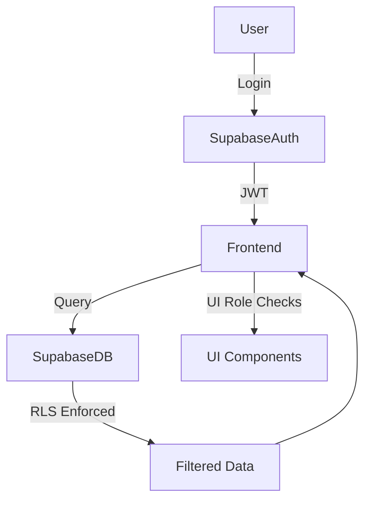

# Supabase RLS Audit & Migration Plan

## Context
The current architecture heavily relies on client-side authorization and business logic, which poses security risks. Enforcing strict Row Level Security (RLS) policies in Supabase is critical.

---

## Findings
- No explicit RLS or security references in the codebase.
- Sensitive authorization logic resides in frontend components and Zustand stores.
- Client-side role checks alone are insufficient for data protection.

---

## Recommended Plan

### 1. Identify Sensitive Data & Access Rules
- **Users:** Access limited to own profile.
- **Projects:** 
  - PMs access projects they manage.
  - Viewers access assigned projects.
  - Admins access all.
- **Portfolios:** Same as projects.
- **Risks & Milestones:** Inherit project access.
- **Audit & Logging:** Track access attempts.

### 2. Define Strict RLS Policies in Supabase
- Enforce row-level access control on all tables.
- Disable public or overly permissive policies.

### 3. Enforce Server-Side Authorization
- All data access filtered by RLS.
- Never rely solely on client checks.

### 4. Minimize Client-Side Authorization
- Use client role checks only for UI/UX.
- Never for data protection.

### 5. Test RLS Policies
- Simulate queries as different roles.
- Attempt unauthorized access to verify restrictions.

### 6. Document RLS Policies
- Maintain clear documentation.
- Link to frontend assumptions.

### 7. Plan Backend Migration
- Gradually move sensitive business logic to:
  - Supabase Views
  - Supabase Edge Functions
  - Or a dedicated backend service

---

## Secure Data Access Flow

- **Critical:** RLS filters data **before** it reaches the frontend.
- **Client-side role checks** only affect UI, not data access.

---

## Summary
Enforcing strict RLS policies and migrating sensitive logic server-side is essential to secure the application and reduce reliance on insecure client-side authorization.