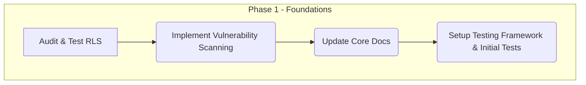
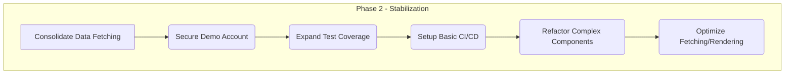

## Proposed Execution Roadmap (Revised v3)

### Phase 0: Comprehensive Discovery and Analysis

*   **Goal:** Gain a comprehensive understanding of the current state, functionality, component structure, and user experience of **all** application pages and core features.
*   **Key Actions:**
    *   Identify and list all distinct pages/routes within the application.
    *   Review each page to inventory its current features and functionalities.
    *   **Identify and document the usage of key UI components across different pages.**
    *   Map key user flows across the entire application.
    *   Identify potential pain points, usability issues, inconsistencies, or bugs across all reviewed areas.
    *   Document findings in a consolidated report, providing a complete overview of the application's current state and component architecture.

```mermaid
graph TD
    subgraph Phase 0 - Comprehensive Discovery & Analysis
        P0A[Identify All Pages/Routes] --> P0B(Inventory Features per Page);
        P0B --> P0F(Identify Component Usage);  // New Action
        P0F --> P0C(Map Key User Flows - Application Wide);
        P0C --> P0D(Identify Issues - Application Wide);
        P0D --> P0E(Document Findings - Consolidated Report);
    end
```

### Phase 1: Foundational Security & Stability

*   **Goal:** Address critical security vulnerabilities and establish foundational practices for maintainability.
*   **Key Actions:**
    *   **Security:** Audit and rigorously test Supabase Row Level Security (RLS) policies.
    *   **Security:** Implement automated dependency vulnerability scanning.
    *   **Maintainability:** Update core documentation (`README.md`, `ARCHITECTURE.md`).
    *   **Maintainability:** Set up a testing framework (Vitest) and write initial unit tests for critical logic (e.g., `authStore`).



### Phase 2: Stabilization & Refinement

*   **Goal:** Stabilize the architecture, improve code quality, enhance performance, and automate processes.
*   **Key Actions:**
    *   **Architecture:** Decide on and consolidate the data fetching strategy (Zustand vs. React Query) and begin refactoring.
    *   **Security:** Review and secure demo account logic.
    *   **Maintainability:** Expand test coverage (integration tests).
    *   **Maintainability:** Set up a basic CI/CD pipeline (linting, testing).
    *   **Code Quality:** Refactor complex components.
    *   **Performance:** Optimize data fetching and rendering.



### Phase 3: Long-Term Strategy & Optimization

*   **Goal:** Address remaining lower-priority items, further optimize, and plan for future scalability.
*   **Key Actions:**
    *   **Architecture:** Evaluate moving logic to Supabase backend (Edge Functions/Views).
    *   **Performance:** Review Supabase database indexing.
    *   **Maintainability:** Complete documentation and establish contribution guidelines.
    *   **Maintainability:** Define a dependency update strategy.

```mermaid
graph TD
    subgraph Phase 3 - Optimization & Future
        P3K[Evaluate Backend Logic Migration] --> P3L(Review DB Indexing);
        P3L --> P3M(Complete Documentation);
        P3M --> P3N(Define Dependency Strategy);
    end